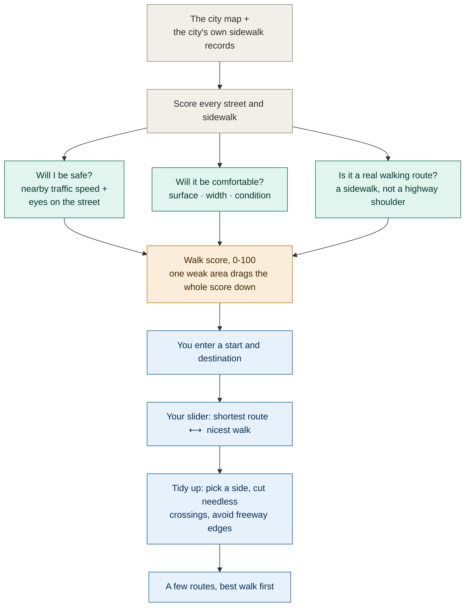
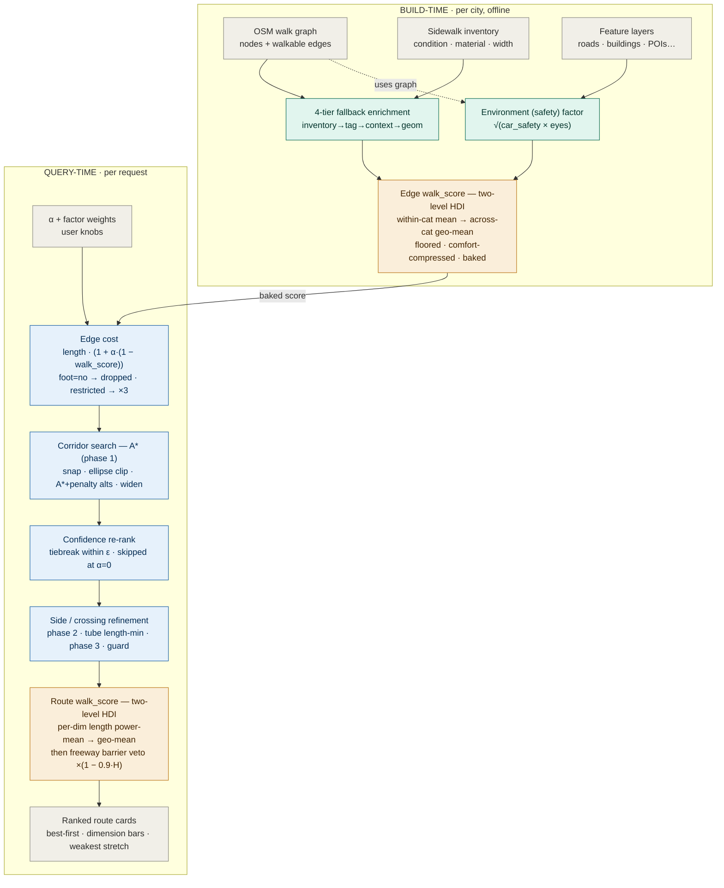

# How the Walk Score Works

*A plain-language guide to how Humanpath rates a walk — and picks your route.*

---

## The short version

Most map apps answer one question: **what's the shortest way there?**

Humanpath answers a better one: **what's the *nicest* way there — and how good is it, really?**

Every sidewalk and street in the city gets a **walk score from 0 to 100**, built from
the things a person actually notices on foot. Then, when you ask for directions, you
decide how much extra distance you'll trade for a more pleasant walk. Turn it one way
and you get the shortest path; turn it up and Humanpath will happily send you a block
over to the calm, tree-lined street instead of the roaring stroad.

---

## What makes a walk "good"?

We boil it down to **three questions**, because that's roughly how people actually
size up a street:

**Will I be safe?**
How fast is traffic on the road you're walking along — or on the busy road right next
to you? And are there "eyes on the street": shops, homes, and open parks that make a
place feel watched-over rather than deserted?

**Will it be comfortable?**
What's underfoot — smooth pavement or crumbling, narrow, patchy sidewalk? Where a city
publishes its own sidewalk-inspection records (condition, material, width), we use them
directly.

**Is it a real walking route?**
A dedicated footpath or a quiet residential sidewalk is a genuine place to walk. The
shoulder of a five-lane arterial is not, even if the pavement happens to be fine.

Each question gets its own sub-score, and together they make the street's walk score.

---

## Why one bad thing sinks the score

Here's the important part. Those three things **can't cancel each other out.**

A flawless brick surface should *not* rescue a walk along a 40 mph highway. So we don't
just average the three scores — we let the **weakest one drag the whole score down.**
It works like a GPA: one failing subject pulls your average down far more than one
perfect subject lifts it. A street has to do reasonably well on *all three* to score
high.

We also lean **conservative on purpose.** If we're unsure, we'd rather slightly
*under*-rate a walk than oversell it — a route that turns out worse than promised is a
worse experience than one that pleasantly surprises you. And plenty of what makes a
walk lovely (an open view, a certain neighborhood feel) simply can't be measured from
data, so we don't pretend otherwise.

---

## From a score to your directions

Once every street has a score, finding a route is a balancing act between **distance**
and **niceness**, and *you* set the balance with a single slider:

- **All the way down** → the plain shortest path. Walkability ignored.
- **Turned up** → Humanpath treats an unpleasant block as if it were longer than it
  really is, so the route "flows downhill" toward the nicer streets — as long as the
  detour is reasonable.

It also does a bit of quiet cleanup you'd never think to ask for: keeping you on one
side of the street instead of zig-zagging across, avoiding needless crossings, and
steering clear of walking along the edge of a freeway. Then it hands you a short list
of routes, **the best walk first**, each with its own score and a note on its weakest
stretch.

---

## The whole thing, at a glance

**How to read it:** the top half happens ahead of time — every street in the city is
scored once. The bottom half happens the moment you ask for directions.

---

<b>Under the hood</b> (for the technically curious)

 

The score is built in **two levels**, deliberately borrowing the structure of the UN's
Human Development Index — a weighted **arithmetic** mean *within* each dimension
(where factors trade off), then an importance-weighted **geometric** mean *across* the
three dimensions (where they don't, so one weak dimension dominates). Each dimension is
floored to a small positive value so a single zero can't annihilate all discrimination.

The same two-level structure is applied twice: once **per edge** at build time (baked
onto the graph), and once **per route** at query time (a length-weighted power mean
across the edges, then the same across-dimension combine, then a non-compensatory
"freeway veto"). Routing itself is A\* with penalty-method alternatives on a cost of
`length · (1 + α·(1 − walk_score))`, followed by a length-minimizing pass in a tube
around each corridor to remove gratuitous crossings.

The code lives in `walkability/scoring/` (the score) and `walkability/routing/` (the
route). `CLAUDE.md` has the full design rationale.

